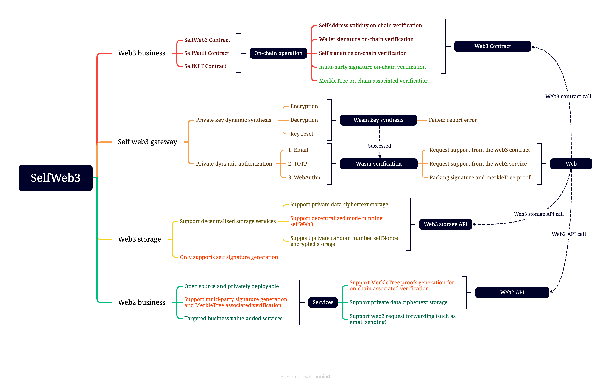

# SelfWeb3

[https://selfweb3.refitor.com][1]

### An on-chain privatization solution that binds Web3 to the user one-to-one, off-chain dynamic authorization (Email + TOTP + WebAuthn) + multi-party signature guarantee + on-chain mandatory verification

###


## Deployed contract

1. **Arbitrum Goerli, 421613: 0xec04F8Ee0493f3d763AB1624BB6aAcaCD94Ac4C1**

2. **opBNB Testnet, 5611: 0x7B6E05a55B1756f827F205BF454BF75288904ecF**

## Security model

### [https://refitself.medium.com/a-privatized-web3-security-model-selfweb3-209439c5d8e2][3]

## Architecture

### [https://github.com/refitor/selfweb3/tree/main/docs/selfweb3-arch.md][2]

### Principle: After dynamic authorization is completed off-chain, it is guaranteed by multi-party signatures invisible to each other to prove the legitimacy of the user's identity on the chain. All parties restrict each other to ensure decentralized operation while providing highly secure privacy protection.



## Self-Host

```shell
git clone https://github.com/refitor/selfweb3.git

cd selfweb3

chmod +x ./build.sh

./build.sh

./selfweb3
```

[1]: https://selfweb3.refitor.com
[2]: /docs/selfweb3-arch.md
[3]: https://refitself.medium.com/a-privatized-web3-security-model-selfweb3-209439c5d8e2
