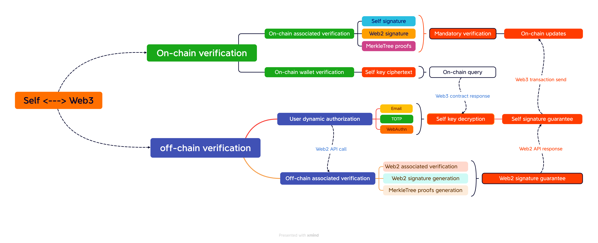

<h1>
A privatized web3 security model — SelfWeb3
</h1>

# 研究动机

### 2009年1月3日，在位于芬兰赫尔辛基的服务器上，至今匿名的神秘技术极客中本聪（Satoshi Nakamoto）生成了第一个比特币区块，自此去中心化的区块链技术以一种纯粹依靠算法建立信任机制的方式开始不断发展，这是革命性的，因为我们日常生活中频繁的交易活动都是基于对交易双方或者第三方机构的信任，这种信任背书强烈的受到不可控因素的影响，包括不透明的内部金融结算，中心化节点故障以及最致命的人为因素干扰，而分布式账本以及去中心化网络所支撑的电子支付系统不需要信任任何人或者服务商即可完成无法被篡改的点对点交易，这是令人极其兴奋的，大刀阔斧砍掉人为因素的同时引入经济激励机制实现自动化运作，虽然相比于传统中心化解决方案很完美，但也存在着缺陷，随着可编程智能合约的支持以及整个web3生态的迅猛发展，一个最基本的问题始终没有得到解决，即A与B的交易确实实现了点对点零信任，最终分布式记账的透明性以及无法被篡改的安全性，却无法证明A与B的合法性, 也就是说怎么证明参与交易的双方真的就是他本人，你当然可以说私钥安全存储是用户自己的事，或许对于那种纯粹手动式的基于双方确认实现共识撮合的点对点交易而言是合适的，但既然要在基于代币经济模型的基础上自动化，合法性的问题就必不可少，不然只会因为人为因素的干扰变得极其危险，因为任何助记词和私钥并不能真正一对一的绑定到人类本身，也就是说，真正影响web3渗透率的关键因素未必就是生态的繁荣程度或者用户投机的狂热程度，而是最起码的安全性保障，点对点交易的隐私保护也不是意味着与作为入口的合法性存在矛盾，因为只是针对身份证明的有效性而并非个人信息，所以合法性的验证根本不需要以中心化KYC为基准，相反更应该在用户自己掌控隐私的前提下动态授权链上行为，只有真正意义上的链上私有化，web3才更有可能与你自己有关，或许当年那位至今匿名的神秘技术极客也思考过这个问题，只是奈何没有更彻底的解决方案。

# 解决方案

## 为了更彻底的为用户自己考虑，也是坚定不移的长期愿景，我们的解决方案完全可以将web2作为零信任服务嵌入私有化架构，并与web3进行组合式集成后构建用户自己的业务生态，比如私有金库, 私有NFT, 私有AI等，也就是说，SelfWeb3只是整个私有化体系的一部分，提供web3金融结算以及链上衍生业务。

## 如何将web3账户与用户自己一对一绑定

在所有使用钱包助记词和私钥作为入口的解决方案中，链上生态单纯的依赖于用户钱包，一旦助记词或者私钥被盗，链上数据将完全没有安全性可言，包括拥有私钥即可对链上数据的完全访问权限，以及任何形式的链上操作行为，这其中主要是web3账户恢复和链上操作两个问题最为严重，恢复机制竟然不需要用户自己动态授权，仅凭明文字符串就可以控制整个账户，再一个链上操作问题，就好比银行账户的所有资金仅仅输入一个密码就可以随意转走，但如果在支持智能合约的链上敏感操作需要进一步的验证，比如存在一种中心化的服务商，专门为用户提供链上事件监控服务，一旦出现敏感操作就先进行链上拦截，再触发web2的动态授权机制，验证通过后更新合约状态进行放行，这样就算助记词或私钥被盗安全性也比完全一股脑的信任钱包好太多，但由于链上状态传递到链下的延迟以及合约状态更新造成的成本问题，这种方案可行性存在问题，如果感兴趣可以参考实验性的开源项目SelfAuth: https://github.com/refiotr/selfAuth, 而更为彻底更加安全的做法，是真正将web3账户绑定到用户自己，并且针对链上状态更新操作强制进行合法性验证，这也是selfWeb3项目构建的最直接目的，以及迫切想要解决的链上安全问题。

### 链下动态授权

要解决一对一绑定，首先需要对用户身份合法性进行验证，在合法性验证方向上更深入的研究可以参考Vitalik关于人格生物特征证明的的文章: https://vitalik.ca/general/2023/07/24/biometric.html, ok, 我们的方案开始并不专注在这一块，而是构建一种链下私有授权和链上动态验证的可扩展框架，由于去中心化的透明性以及智能合约的局限性导致链上针对用户身份的动态验证非常棘手，相反我们的思路是依靠web2成熟的动态授权技术方案，通过链上链下协作对动态授权的合法性进行强制验证，以一种类似零知识证明的方式由链下针对动态授权合法性进行陈述，并生成相应证明，在多方担保签名后交由链上合约进行动态验证，具体授权方式包括Email, TOTP, WebAuthn等，为了进一步加强私有授权的合法性，多种动态授权依据具体业务场景进行关联组合，同时由于授权和验证机制在链下完成，其中涉及到的关键数据由存储在链上合约的私有密钥进行加密维护，具体包括TOTP基于时间的密钥种子，WebAuthn密钥等，在动态解密并计算出共享密钥后才能成功提取出相应的加解密密钥，进而以去中心化的方式完成动态授权的验证。

### 链下关联验证

所谓的关联验证是指多种动态授权组合后由web2服务完成关联有效性的验证，由私密随机数和web2随机数分别与时间戳timestamp异或后生成动态随机数并完成交换，在每次动态授权校验通过后对该随机数进行具体步长递增，再由web2服务根据关联路径进行随机数回溯递减以及再次异或的形式验证是否与web2Nonce一致，通过后生成链上关联验证的合法性陈述，目的是作为用户身份合法性验证的担保方审核，所以只是目前的一种中心化实现方式，后续可能会调整到完全去中心化的解决方案，因为真正需要web2中心化服务参与的只是作为担保方成员，在用户授权的情况下参与多方签名，而在签名之前所有动态授权和关联验证流程完全可以在私有的去中心化环境完成，这样做的好处是既可以保证关联验证脱离中心化环境运行，也可以通过更多拥有可靠信任背书的中心化服务商加强多方签名验证的安全性，当然引入多方签名服务商的前提是由用户自己自由授权并需要有相应的经济激励以及灾难性的惩罚机制，在完成关联有效性验证后，再由web2服务不对外的私钥进行签名，同动态解密出的私有私钥签名一起打包，用以证明用户完成的关联授权合法性，同时针对签名消息生成动态的默克尔树证明用于链上针对重放攻击的验证。

### 链上动态验证

由于去中心化的透明性以及智能合约的局限性，目前的验证方案类似于零知识证明的验证，也是针对链下某种陈述生成证明后的验证，但链上成本仅包括部署合约时提供的web2服务私有地址，用户自己的唯一地址, 以及用于重放攻击验证的默克尔树根哈希，后续可能会在零知识证明方向进行深度研究后考虑是否进行调整，但目的是一致的，都是针对链下的合法性事实进行陈述，用于在链上证明链下某种行为的有效性，在完成多方签名的验证后，为了防止同一签名进行多次验证，采用默克尔树动态验证叶子合法性进行实现，但这种方式在每次验证后都需要更新链上存储的默克尔树根哈希，所以只适合针对链上状态更新的验证，相反进行链上数据查询的操作只会验证钱包签名是否合法，这也是为了防止用于关联验证的签名泄漏，同时针对敏感操作联合钱包签名一起加强链上合约验证的安全性，再一个考虑到多方签名的重要性，任何一方都必须在保证私有加密和存储的基础上，进行各自不可见的私密签名，之所以采用多方签名，并不是简单的通过多个维度加强验证的安全性，而是在相互制约的前提下进行组合验证，同时由于web2服务成熟的动态授权和安全防护技术方案，这种链上多方担保签名和重放攻击的验证方式支持在用户自己授权的前提下拓展到更复杂的群体性共识，用于向链上强力证明用户唯一身份的合法性，并且遵循只能是动态的验证原则，而不是基于某种合法性凭证的静态验证。

## 如何确保一对一绑定的安全性

在针对用户身份合法性的验证逻辑中，如果完全在链上校验是最安全的，但这是自相矛盾的，因为既要保证用于授权的私有信息保密，又无法改变链上环境透明性的限制，而零知识证明也仅仅只是一种用于实现链上验证的方式，同样需要在私有动态授权的前提下才真正有效，不然你真的能保证是用户自己授权生成的证明？所以为了保证合法性验证的有效，包括动态授权，授权验证，关联性验证以及多方签名四个环节需要高度的安全性保障，其中私有动态授权依赖于私有密钥的安全防护，授权验证在去中心化环境中由隐私计算节点提供安全保障，而关联性校验和非私有的的动态签名由私有化的零信任web2服务提供支持。

### 私有密钥安全性
	
在将web3账户与用户自己一对一绑定的实现方案中，涉及到私有密钥和私有数据的安全性问题，如果这两部分数据的安全性得不到保证，根本谈不上真正意义上的绑定，而要解决私有密钥的安全性，首先是私有密钥设计问题，由于需要用到私有私钥selfPrivate进行签名担保，也需要参与动态计算共享密钥用于TOTP验证和WebAuthn密钥提取，所以对它的保护极其重要，在充分考虑到各种因素的干扰后，采用三方互不信任的方式对私有私钥selfPrivate进行混合加密，在引入私有的第二个密钥selfKey后，第一层先针对selfKey，由web2服务私钥与web3公钥动态计算出的共享密钥web2DHKey以及用户钱包进行先后加密共同保证selfKey的安全性，第二层再通过selfKey和用户自行输入的密码selfPass混合加密selfPrivate, 这样其实针对selfPrivate的保护存在三个维度的控制，即web2服务、用户钱包和用户自行输入的密码，之所以需要用户自行输入密码，是为了防止一旦钱包和web2服务中的任何一方存在被攻击丢失控制权的情况下，私有私钥selfPrivate依旧安全，而自行输入的密码也支持重新设置以及受到web2服务和钱包的双重约束，为了进一步加强密钥安全性，包括TOTP密钥重置，SelfPass重置，以及钱包重新绑定等密钥重置都需要邮件的有效性和验证码动态验证通过，其中有效性是指用于重置的邮件必须与注册时输入的一致，一致性的判断以在丢弃web3私钥的情况下由web3公钥对邮件进行签名验证为准，同时需要在链上完成多方签名担保验证和默克尔树验证，其次在抛弃中心化存储以及减轻用户心智负担的综合考量后，采用链上合约支持私有密钥的防篡改存储，selfPrivate和selfKey在selfPass重置或者钱包重新绑定后支持链上更新，同时需要在链上完成多方签名担保验证和默克尔树验证。

### 隐私计算安全性
	
为了向web3证明用户自己身份的合法性，用于直接验证用户身份的动态授权同样需要以去中心化的方式运行，否则在中心化服务持有私有信息的情况下完全可以伪造动态授权的结果，所以在目前的实现方案中由无法被篡改的链上环境维护私有密钥密文，存储服务持久化私有数据密文，以及在去中心化的环境中为用户身份链下验证和证明生成提供明文计算服务，这样虽然可以保证用户隐私并不会受到中心化环境各种因素的影响，但用于提供明文计算服务的隐私计算节点却需要更强有力的安全防护，在目前的实现方案中，隐私计算节点采用WebAssembly技术嵌入在浏览器网页中运行，为了尽可能对私有数据进行保护，实现逻辑中仅仅针对密文进行缓存，每次进行动态授权或者验证等都需要重新解密再计算，同时针对wasm文件合法性，暂时在动态计算文件hash值后由链上合约动态验证合法性进行保证，后续将重点针对去中心化环境和安全性进行优化升级。

### web2服务私有化

由于用户身份采用链下多方签名担保代替链上直接验证，担保内容的合法性以及签名的安全性就直接影响到整个验证是否有效，试想如何才能保证web2服务无法伪造签名内容的情况下进行担保，同时还不能对外公开服务内部的私钥，之所以需要web2服务保持内部私钥的私密性，是为了针对多种动态授权组合是否有效的担保，就算以去中心化的方式完成关联性校验，也同样需要获得web2服务的认可并授权，否则web2服务参与多方签名就毫无意义，而如何防止伪造关键在于web2服务私钥是否安全，在目前的实现方案中，通过混合加密以及由隐私计算节点校验web2服务有效性的方式提供支持，先由web2服务不对外的密钥加密再由selfPass加密，并且由web2服务和web3去中心化存储平台分别持久化，用于保证web2服务和隐私计算节点均无法独立解密，也就是说web2服务必须由用户自己授权才能提供私有化服务，否则没有私钥无法动态生成担保签名，而隐私计算节点校验web2服务有效性的目的是确认web2私钥的提取确实经过了混合解密，防止web2服务私钥被盗后进行非法使用，另一方面，为了验证针对web2服务的用户身份验证，WebAuthn不仅作为私有动态授权的一部分，同时也用于web2服务私有化验证，由于隐私计算节点和web2服务交互全部采用网络密钥交叉计算出的共享密钥进行点对点加密通讯，web2服务保持无状态运行暂时并不提供会话缓存，相当于一种中心化的私有服务节点。

### 私有数据存储安全性
	
私有数据是非私有密钥信息在加密后进行安全存储的部分，包括混合加密后的web2服务私钥密文，用户自行输入的密码selfPass密文, 用于TOTP验证的密钥种子密文，webAuthn密钥密文，进行关联验证时采用的私密随机数以及web3公钥等，为了以去中心化的web3模式运行，在私有密钥加密的基础上再通过钱包加密后存储到web3存储平台，同时在启用web2服务的情况下，部分加密的私有数据在web2服务密钥再次加密后进行备份存储，不包括私密随机数密文，之所以采用混合存储架构，是为了规避中心化服务可能导致的私有数据非法访问或者不可用等情况，同时也是基于中心化服务的高效率提供web2环境的用户体验，由用户钱包，私有密钥和web2服务三方共同维护私有数据的安全性。

## 优化升级

由于链上动态验证的引入，用户钱包仅仅作为与web3进行交互的工具入口，但同样作为用户身份合法性证明的一部分，只是并非唯一，钱包签名也需要参与关联验证流程，针对系统业务层，由用户钱包、链下动态授权和关联验证以及链上动态验证和重放攻击验证进行保障，就系统整体的安全性而言，包括用户钱包、用户自行输入的密码、web2服务私钥、私密随机数以及私有密钥等多个维度共同维护，之所以在目前的方案中引入web2服务，是为了保证担保审核方一定程度的私密，也是在私有化方向上不断迭代优化的基础，同时由于去中心化固有的特性，为了将零信任web2服务和web3生态嵌入进私有化架构，后续可能会在硬件钱包服务或者非web网页形式等方面进行集成优化，如果需要进一步了解系统架构以及实现源码，请参考官方开源仓库: https://github.com/refitor/selfweb3, 如果有进一步的合作意向，欢迎与我们团队取得联系。

